#  ProyectoIS — Sistema de Simulación y Cálculo de Redes de Computadoras-NetCalcPro

---

##  Descripción del proyecto

ProyectoIS es un sistema de software desarrollado en Java con arquitectura por capas que permite la simulación, diseño y gestión de redes de computadoras.

El sistema automatiza cálculos de subneteo (VLSM), gestión de dispositivos, administración de proyectos, registro de fallas y supervisión técnica.

Este proyecto está basado en un proceso completo de ingeniería de software con análisis, diseño, implementación, pruebas y mantenimiento.

---

## Objetivo del sistema

- Automatizar el cálculo de redes y subredes (VLSM/CIDR)
- Reducir errores humanos en diseño de infraestructura de red
- Gestionar proyectos de redes en entornos académicos o empresariales
- Implementar una arquitectura modular escalable
- Aplicar control de versiones con GitHub Flow
- Integrar persistencia de datos con MariaDB

---

##  Arquitectura del sistema

El sistema está dividido en 4 capas:

###  Capa de Interfaz (InterfazVisual)
- Formularios en Java Swing
- Paneles de control
- Registro de usuarios, proyectos y fallas

###  Capa de Negocio (CapaDeNegocio)
- Cálculos de red (VLSM, subneteo)
- Consumo eléctrico
- Validaciones de ingeniería

###  Capa de Datos (CapaDatos)
- Conexión a MariaDB
- Persistencia de datos
- Consultas SQL

###  Capa de Sesión (CapaIU)
- Autenticación de usuarios
- Control de roles
- Manejo de sesión

---

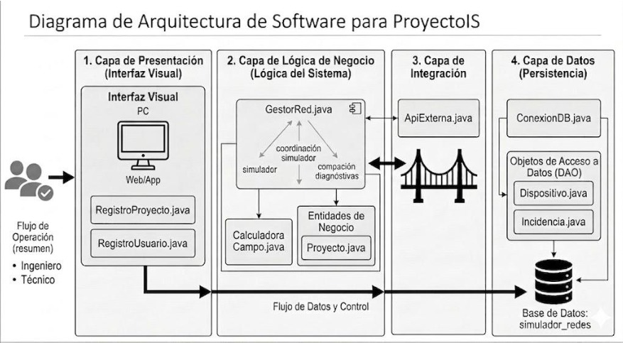

##  Estructura del proyecto
ProyectoIS/

│

├── src/

│ ├── CapaDatos/

│ ├── CapaDeNegocio/

│ ├── InterfazVisual/

│ ├── CapaIU/

│

├── docs/

│ ├── arquitectura.md

│ ├── manual_usuario.md

│ ├── flujo_git.md

│ └── control_versiones.md

│

├── assets/

│ ├── imagenes/

│ └── diagramas/

│

├── tests/

├── data/

├── pom.xml

└── README.md

---

##  Requerimientos del sistema

###  Hardware mínimo

- Procesador: Intel i3 o superior
- RAM: 4 GB mínimo (8 GB recomendado)
- Disco: 500 MB disponibles
- Resolución: 1366x768 o superior


###  Software necesario

- Java JDK 21
- Apache Maven 3.9+
- NetBeans 21+
- MariaDB Server 10.x / 11.x
- Sistema operativo: Windows 11 

Este entorno solo fue probado bajo el sistema operativo de Windows 11.

---

##  Base de datos

- Nombre: `simulador_redes`
- Puerto: `3016`
- Motor: MariaDB

### Tablas principales:

- usuarios
- proyectos
- dispositivos
- tickets
- checklist_gabinete

---

## Procedimiento de instalación

### 1. Clonar el repositorio

```bash
git clone https://github.com/usuario/ProyectoIS.git
cd ProyectoIS
```

## 2. Configuración de la base de datos

###  Crear base de datos en MariaDB

```sql
CREATE DATABASE simulador_redes;
```
 Configuración del usuario

El sistema está configurado para conectarse con:

Usuario: root
Contraseña: 3016
Puerto: 3016

 Es importante que MariaDB esté ejecutándose en este puerto para evitar errores de conexión.

## 3. Configuración de dependencias

El proyecto utiliza Maven, por lo que las dependencias se descargan automáticamente al compilar el proyecto.

### Dependencias principales:
mariadb-java-client → Conexión a base de datos MariaDB

AbsoluteLayout → Diseño de interfaces en NetBeans
### Compilación del proyecto
```bash
mvn clean install
```

### Ejecución del sistema

```bash
mx.edu.uv.proyectois.ProyectoIS
```
Ejecutarla desde el IDE (NetBeans o IntelliJ) o desde Maven.

## 4. Configuración del entorno de desarrollo

### NetBeans IDE
Importar el proyecto como Maven Project
Verificar que el JDK sea 21 o superior
Configurar ejecución del proyecto principal

### Base de datos
Iniciar servidor MariaDB
Crear la base de datos simulador_redes
Verificar conexión en el archivo:
ConexionDB.java

## Diagramas UML del sistema

Esta sección contiene los diagramas UML del sistema para comprender su estructura y funcionamiento.
 
-  Diagrama de clases   
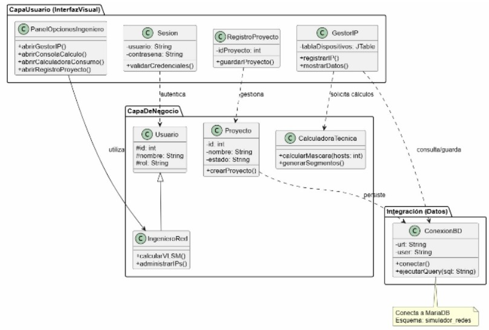

-  Diagrama de casos de uso 
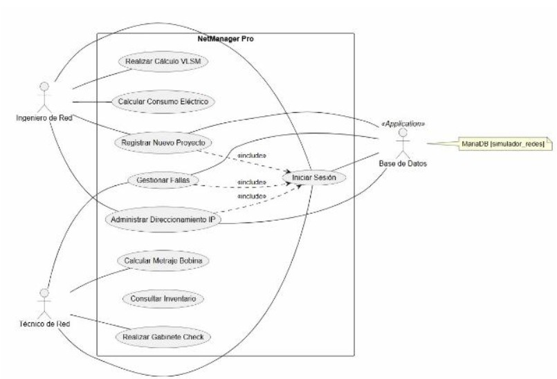

---

##  Licencia

Este proyecto es de uso académico y educativo.

---
##  Ejemplos de Ejecución

En esta sección se muestran evidencias visuales del funcionamiento del sistema.

---

###  Pantalla de inicio de sesión
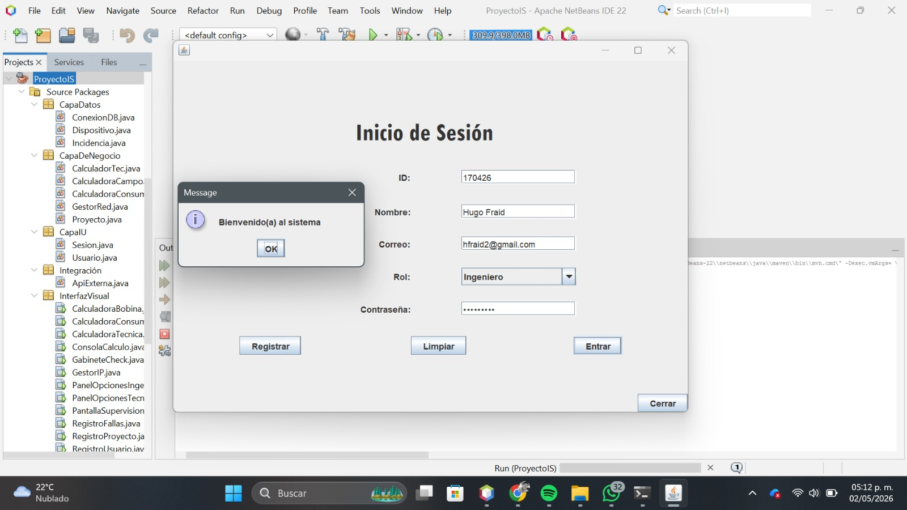

---
### Panel Opciones Tecnico
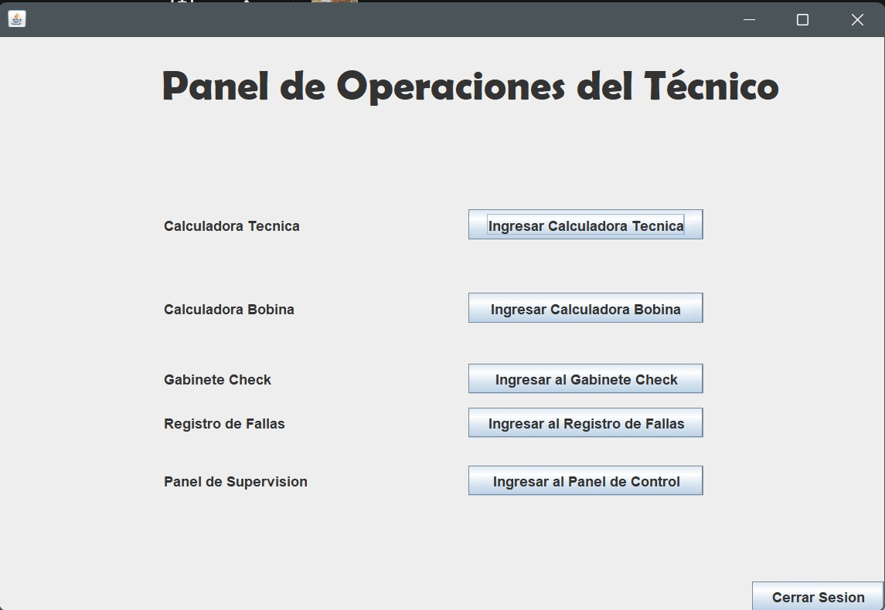
---
### Panel Opciones Ingeniero
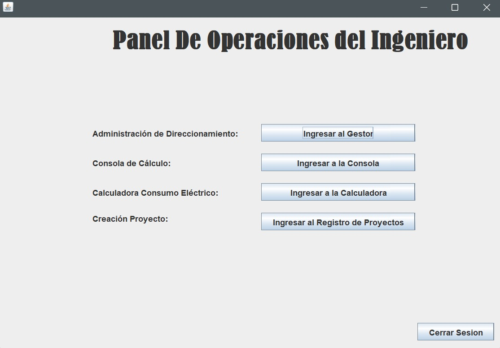
---
###  Panel administración de Direccionamiento
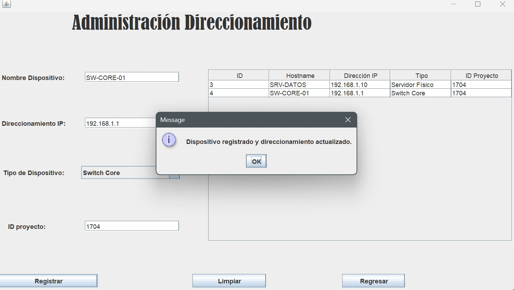
---

### Módulo de cálculo de redes
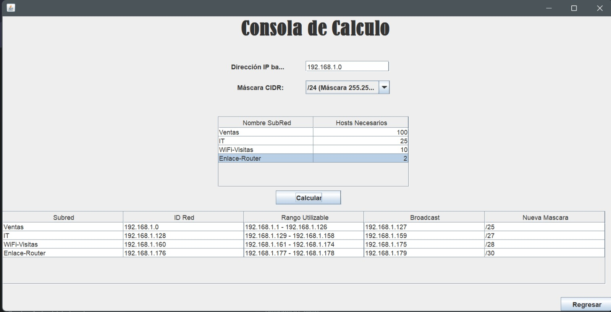
---

### Módulo de cálculo energético
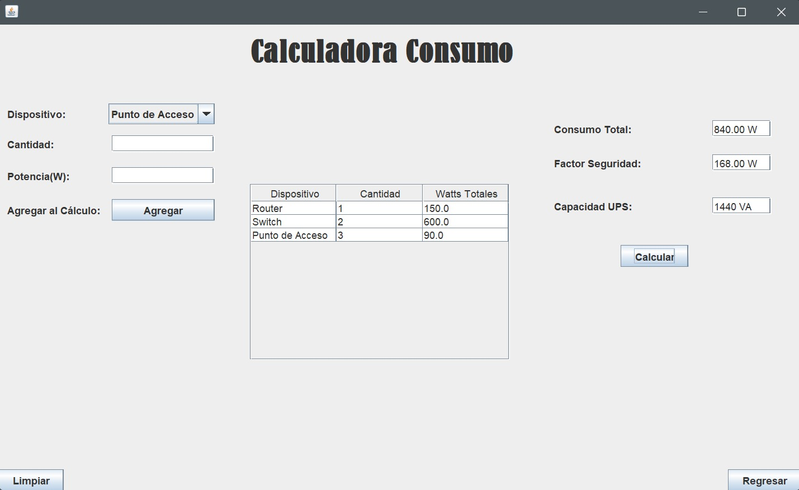
---
### Módulo de registro de proyectos
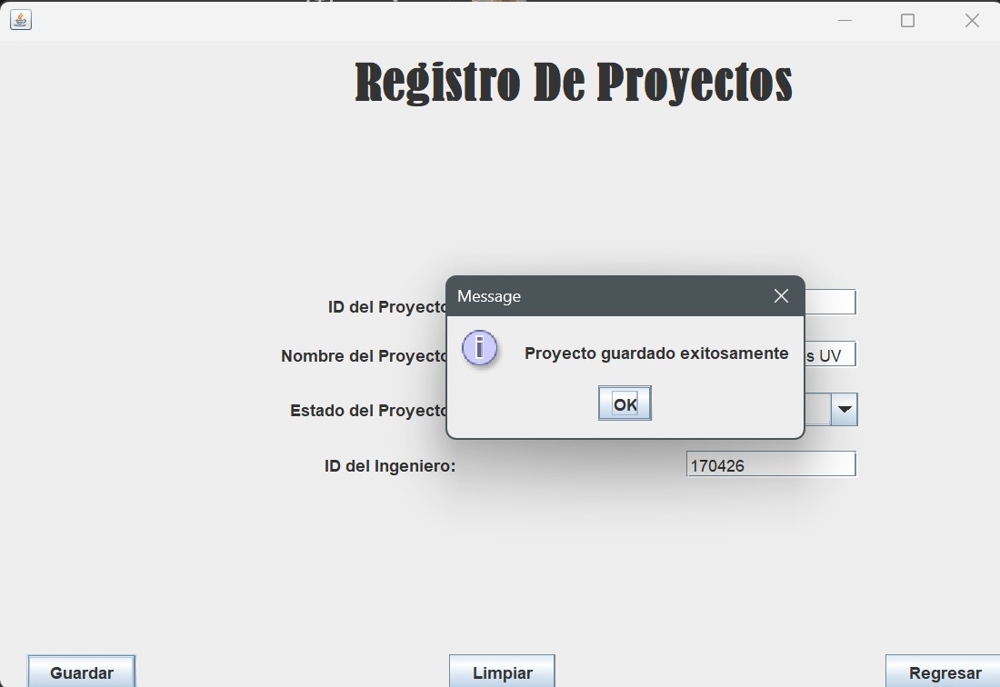
---
### Módulo de cálculo técnico
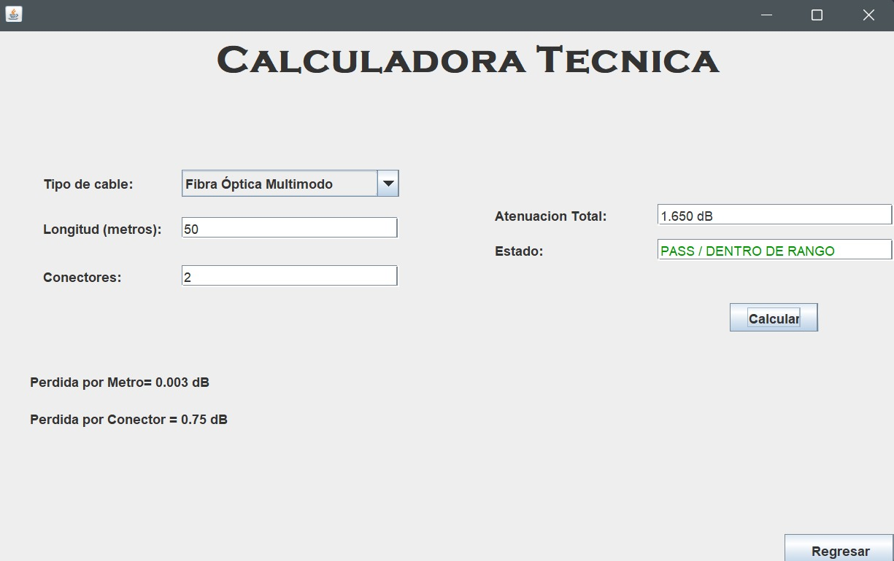
---
### Módulo de cálculo bobina
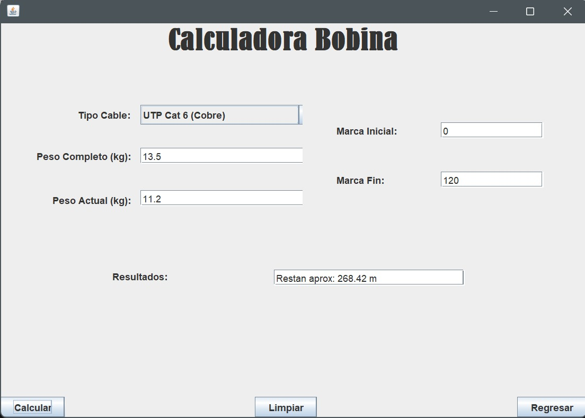
---

### Registro de fallas
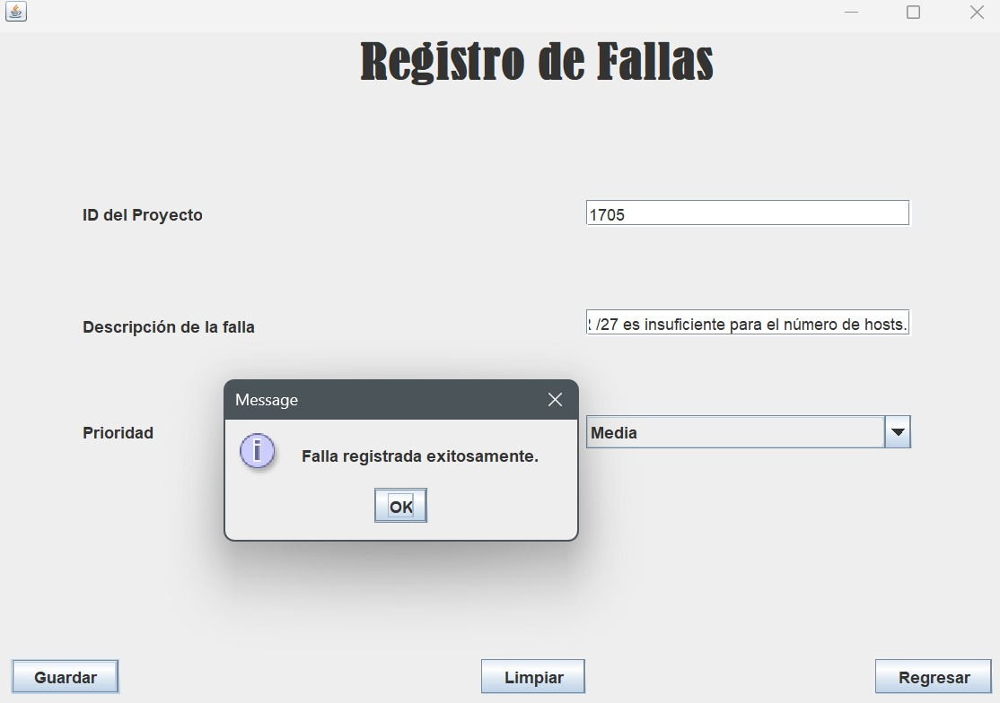
---

###  Supervisión de gabinetes
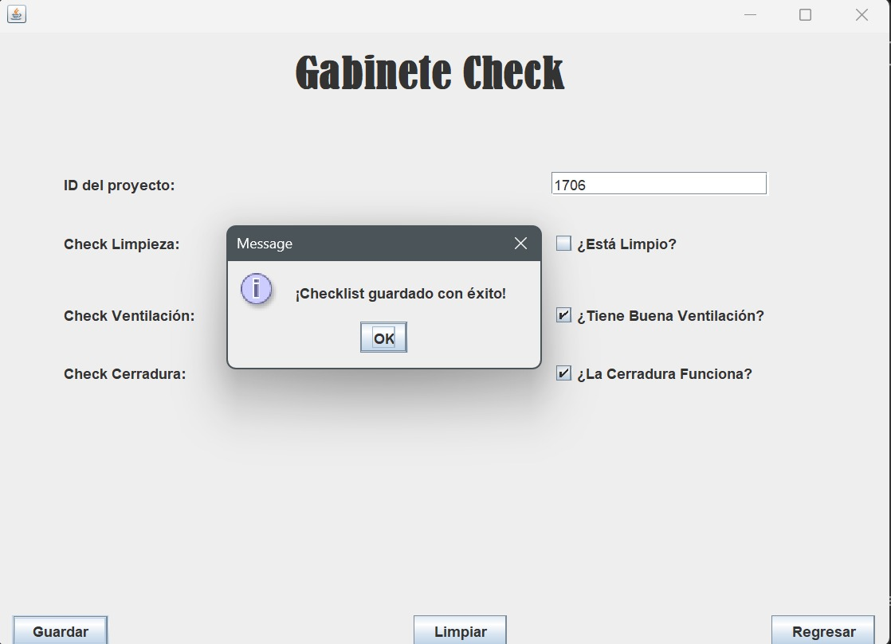
---

###  Panel de supervisión
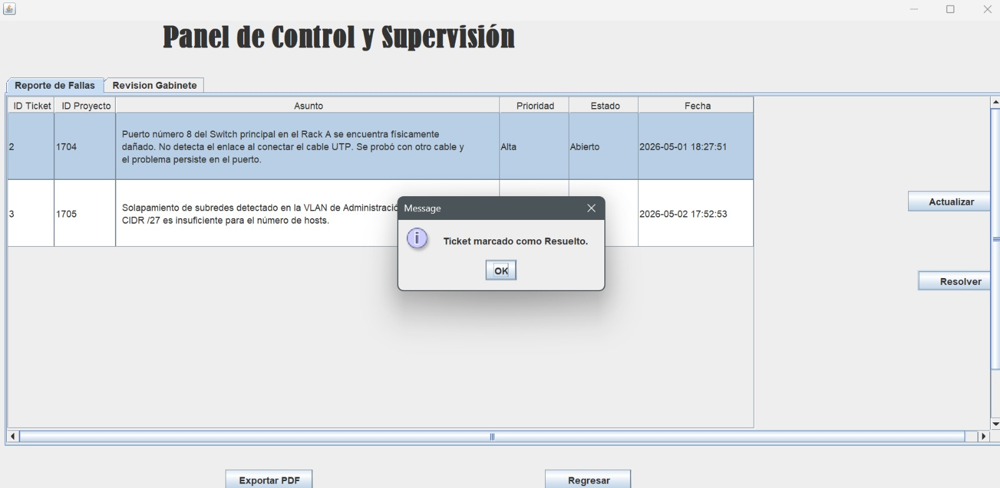
---

##  Autores

Proyecto desarrollado como parte de Ingeniería de Software.

- Hugo Fraid Cruz López
- Andrés Hazael Cruz Torres
- Andrea Garcia Ramos
- José Fabián Ferral Paredes
 
Este proyecto fue desarrollado en la Universidad Veracruzana.

---

##  Notas importantes

- La base de datos debe estar activa antes de ejecutar el sistema  
- El puerto MariaDB debe ser **3016**  
- El proyecto utiliza arquitectura por capas  
- Es necesario Maven para la gestión de dependencias  
